# Step 1: Get RDS Resource Name

***Go to RDS Dashboard***
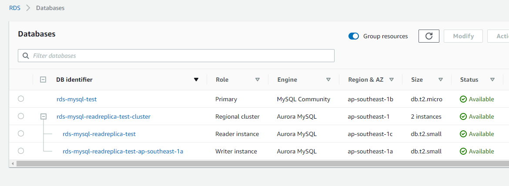

***Click to `rds-mysql-test` RDS and get info:***

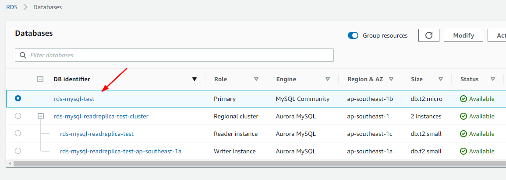
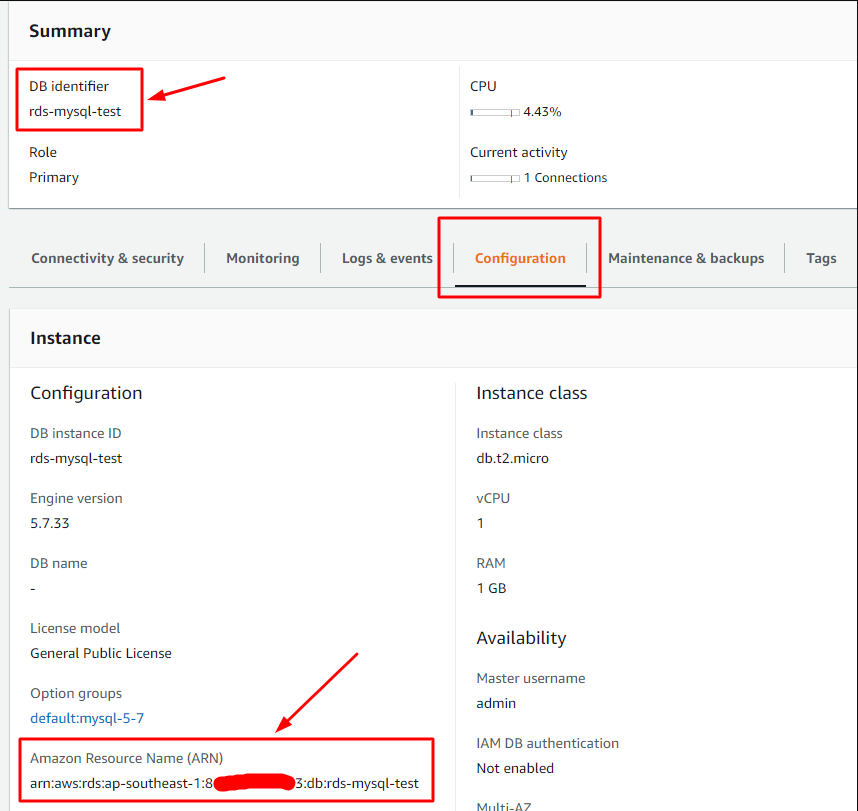

***Click to `rds-mysql-readreplica-test-ap-southeast-1a` RDS and get info:***

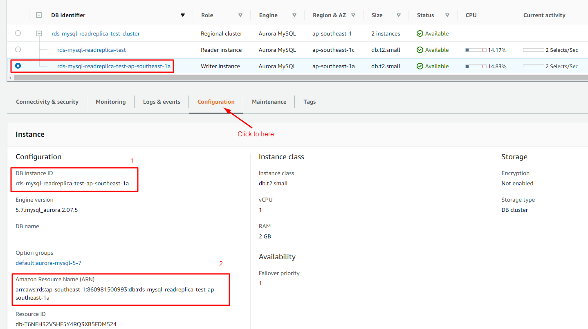

***Click to `rds-mysql-readreplica-test` RDS and get info:*** Same above

```
- RDS 1
+ DB identifier: rds-mysql-test
+ Resource Name: arn:aws:rds:ap-southeast-1:860981500993:db:rds-mysql-test

- RDS 2
+ DB identifier: rds-mysql-readreplica-test
+ Resource Name: arn:aws:rds:ap-southeast-1:860981500993:db:rds-mysql-readreplica-test

- RDS 3
+ DB identifier: rds-mysql-readreplica-test-ap-southeast-1a
+ Resource Name: arn:aws:rds:ap-southeast-1:860981500993:db:rds-mysql-readreplica-test-ap-southeast-1a
```

# Step 2: Create a custom Policy

***Go to `IAM` service:***
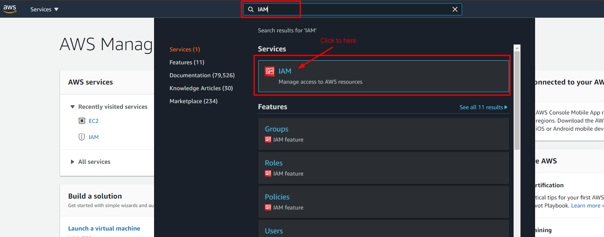

***Create new `Policy`***. JSON string at below:

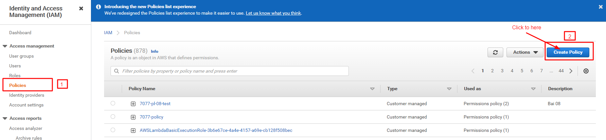
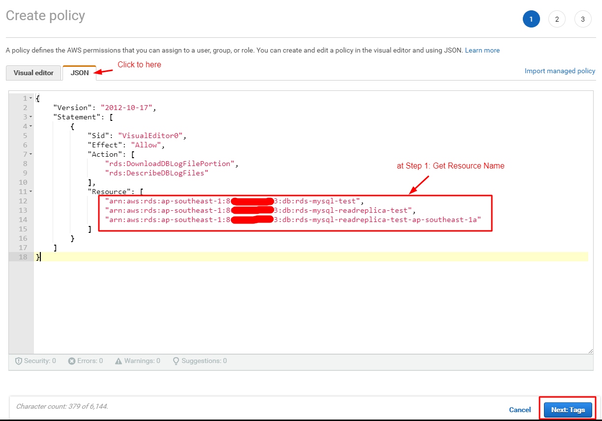
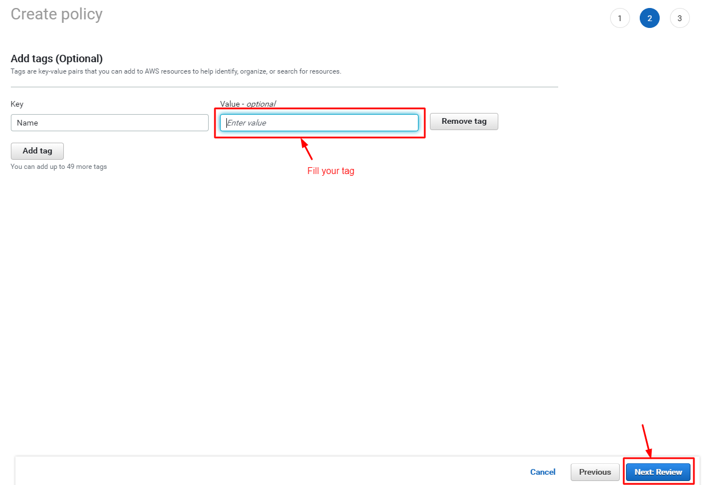
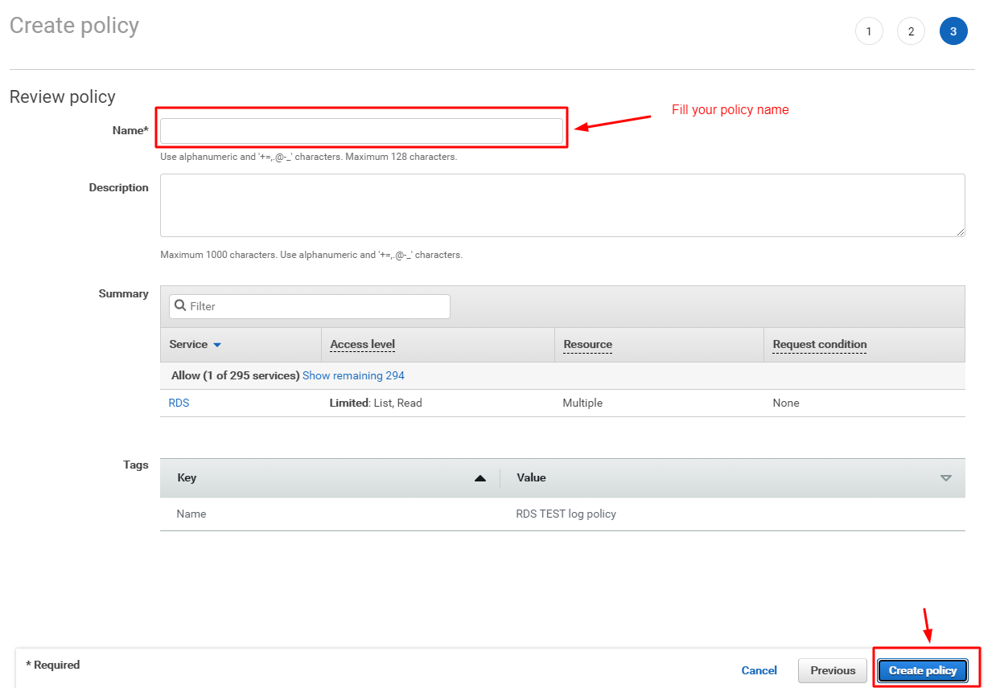

```
{
    "Version": "2012-10-17",
    "Statement": [
        {
            "Sid": "VisualEditor0",
            "Effect": "Allow",
            "Action": [
                "rds:DownloadDBLogFilePortion",
                "rds:DescribeDBLogFiles"
            ],
            "Resource": [
                "arn:aws:rds:ap-southeast-1:860981500993:db:rds-mysql-test",
                "arn:aws:rds:ap-southeast-1:860981500993:db:rds-mysql-readreplica-test",
                "arn:aws:rds:ap-southeast-1:860981500993:db:rds-mysql-readreplica-test-ap-southeast-1a"
            ]
        }
    ]
}
```

# Step 4: Attach Policy to Role

***Go to `IAM => Roles`, Attach policy created from Step 3 to your role:***

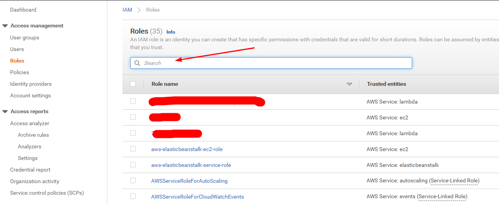
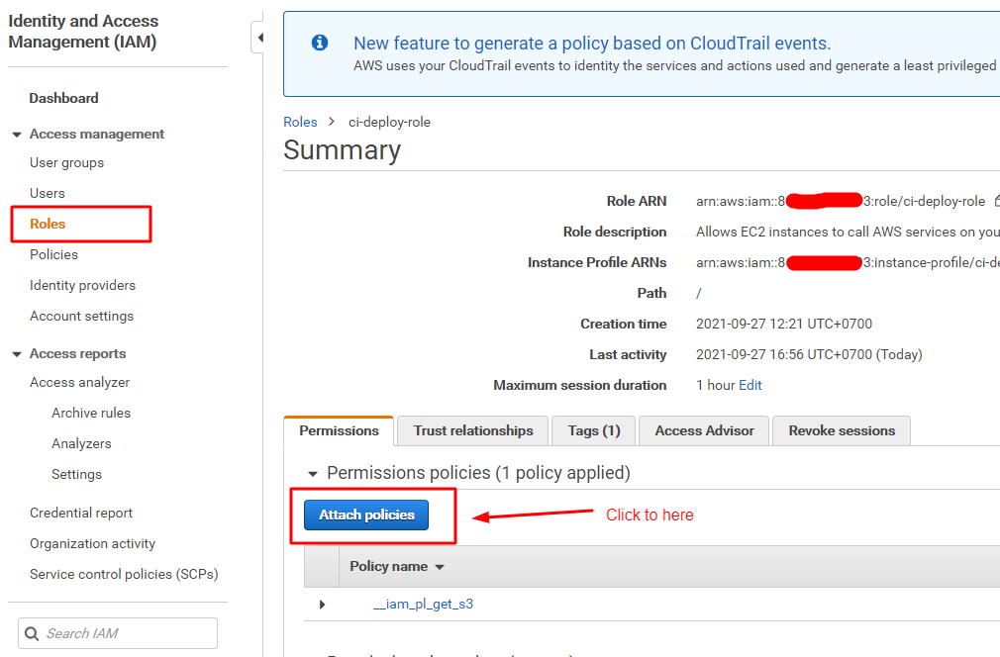
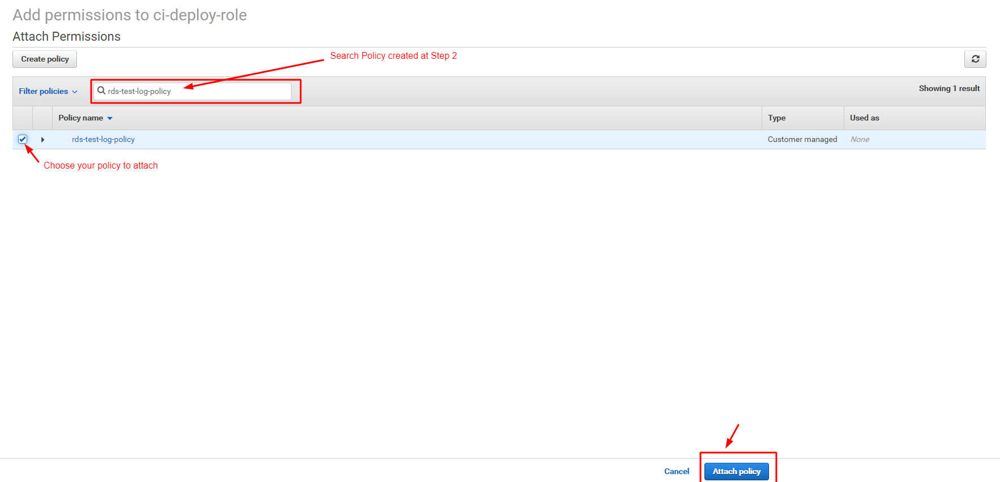

# Step 5: Verify

- SSH to Webserver and exec command-lines below:

***Get LogFileName:***
```sh
aws rds describe-db-log-files --db-instance-identifier rds-mysql-test --region ap-southeast-1
aws rds describe-db-log-files --db-instance-identifier rds-mysql-readreplica-test --region ap-southeast-1
aws rds describe-db-log-files --db-instance-identifier rds-mysql-readreplica-test-ap-southeast-1a --region ap-southeast-1
```

***Download log file:***
```sh
aws rds download-db-log-file-portion \
--region ap-southeast-1 \
--db-instance-identifier rds-mysql-test \
--log-file-name general/mysql-general.log \
--output text > /mnt/rds-mysql-test_general_log.txt

aws rds download-db-log-file-portion \
--region ap-southeast-1 \
--db-instance-identifier rds-mysql-readreplica-test \
--log-file-name general/mysql-general.log \
--output text > /mnt/rds-mysql-readreplica-test_general_log.txt

aws rds download-db-log-file-portion \
--region ap-southeast-1 \
--db-instance-identifier rds-mysql-readreplica-test-ap-southeast-1a \
--log-file-name general/mysql-general.log \
--output text > /mnt/rds-mysql-readreplica-test-ap-southeast-1a_general_log.txt
```

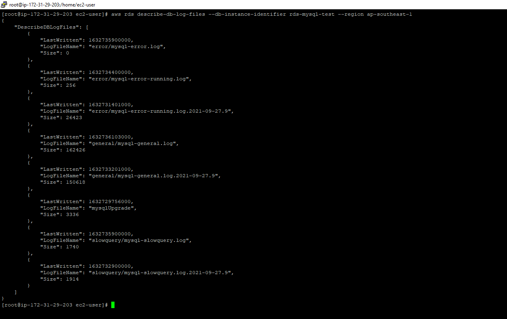
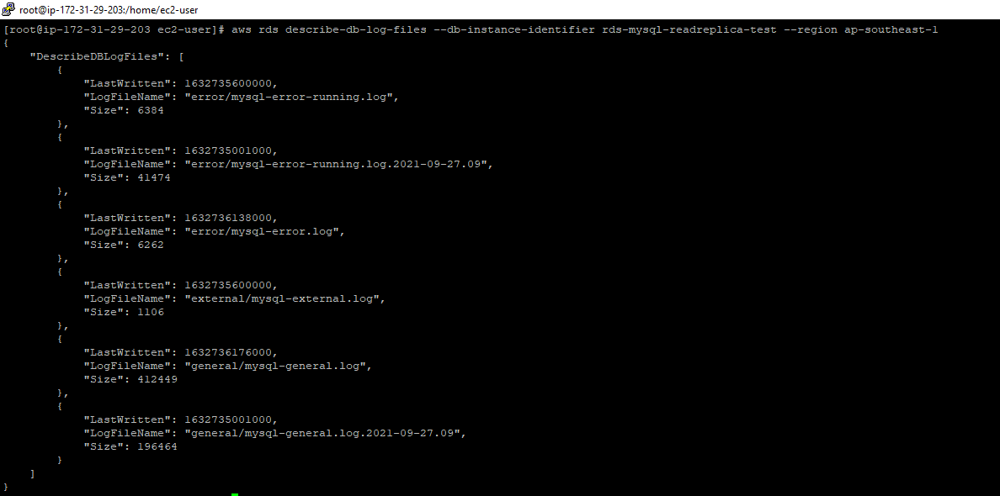
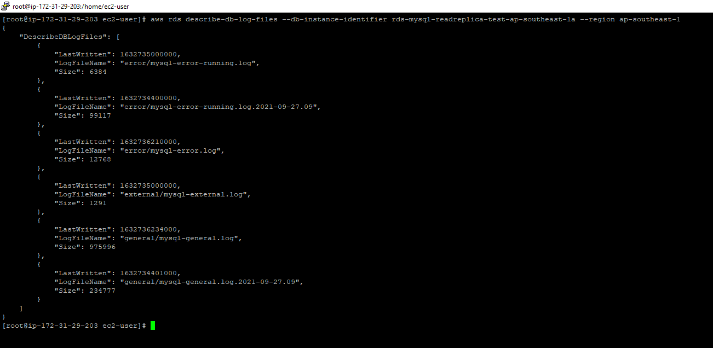
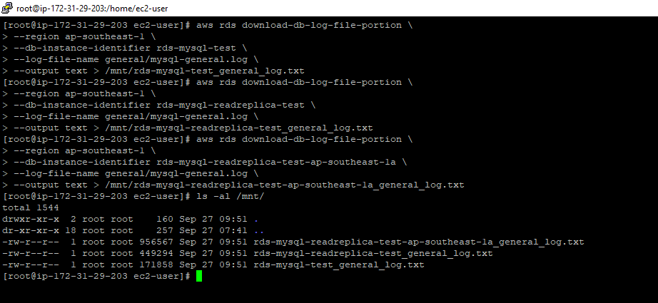
